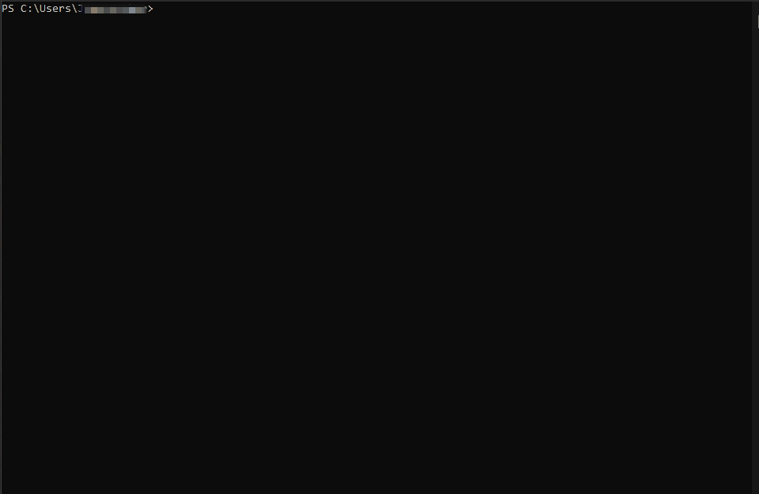

[](https://GitHub.com/punk-security/secret-magpie-cli/graphs/commit-activity)
[](https://www.punksecurity.co.uk)
[](https://sonarcloud.io/summary/new_code?id=punk-security_secret-magpie-cli)
[](https://sonarcloud.io/summary/new_code?id=punk-security_secret-magpie-cli)
[](https://sonarcloud.io/summary/new_code?id=punk-security_secret-magpie-cli)

          ____              __   _____                      _ __       
         / __ \__  ______  / /__/ ___/___  _______  _______(_) /___  __
        / /_/ / / / / __ \/ //_/\__ \/ _ \/ ___/ / / / ___/ / __/ / / /
       / ____/ /_/ / / / / ,<  ___/ /  __/ /__/ /_/ / /  / / /_/ /_/ / 
      /_/    \__,_/_/ /_/_/|_|/____/\___/\___/\__,_/_/  /_/\__/\__, /  
                                             PRESENTS         /____/  
                              Secret-Magpie ✨
                                                  
    
# SecretMagpie 

## Intro

Organisations struggle to scan for leaked secrets in ALL of their repos.  It's easy to scan one repo, but time consuming and tedious to scan all of them.

SecretMagpie is a secret detection tool that hunts out all the secrets hiding in ALL your repositories. 

It supports finding repos in Github, Gitlab, Azure DevOps (ADO), Bitbucket and the local file system.

Given an auth token, it will:

* enumerate all of the repos
* clone each repo down
* scan EVERY branch with multiple tools
* squash all the findings into one big list
* deduplicate them so you dont triage the same thing twice
* give you some great stats and a full report in csv or json

## See it in action!



By making use of the opensource tools [Trufflehog](https://github.com/trufflesecurity/trufflehog) 🐷 and [Gitleaks](https://github.com/zricethezav/gitleaks), SecretMagpie can highlight a variety of different secrets and ensure that nothing is missed!

We plan on adding more tools soon, providing even wider coverage.

The easiest approach is to use Docker...

## Running SecretMagpie in Docker

We've kept things nice and simple and bundled everything into a Docker container to enable you to start finding secrets as soon as possible. 

Simply run one of the following commands to get started:
for github, gitlab or azuredevops
```shell
docker run punksecurity/secret-magpie <github/gitlab/azuredevops> --org 'organisation name' --pat 'personal access token'
```
or for bitbucket
```shell
docker run punksecurity/secret-magpie bitbucket --workspace 'workspace name to scan' --username 'your username' --password 'your application password'
```
or for the local filesystem
```shell
docker run -v /local/path/to/repos/:/repos punksecurity/secret-magpie filesystem --path /repos
```
## Get your results
You can copy your results file back out of the completed container with this command.

You need the container id, which should be output when you ran the run command. 

If needs be, you can run "docker ps -a" to find your container id.

```
docker cp 'container':/app/results.[csv/json] /host/path/target
```

Alternatively you mount the volume the results folder and direct output to it

```
docker -v /localpath:/app/results run punksecurity/secret-magpie <other options> --out results/results
```
# Passing certificates to Docker
If you're running our tool inside Docker, you may find you need to pass in CA certificates from the host.

This can be achieved using the following command

```
docker -v /path/to/your/certificates:/usr/local/share/ca-certificates/ run punksecurity/secret-magpie <other options> --update-ca-certificates
```

## Running the tool locally

If you prefer not to use Docker then you will need to manually install the following:

* Python 3.10
* Git
* [Trufflehog 3.20.0](https://github.com/trufflesecurity/trufflehog/releases/tag/v3.20.0) installed and on PATH
* [Gitleaks v8.15.2](https://github.com/zricethezav/gitleaks/releases/tag/v8.15.2) installed and on PATH

You will also need to install the dependencies in requirements.txt by running the following command:

```
pip install -r requirements.txt
```

You can run it like this:
for github, gitlab or azuredevops
```shell
python main.py <github/gitlab/azuredevops> --org 'github organisation name' --pat 'personal access token'
```
or for bitbucket
```shell
python main.py bitbucket --workspace 'workspace name to scan' --username 'your username' --password 'your application password'
```
or for the local filesystem
```shell
python main.py filesystem --path <path to repos>
```

## Full Usage

```
usage: 
 main.py {bitbucket/github/gitlab/azuredevops/filesystem} [options] 

positional arguments:
  {github,gitlab,bitbucket,azuredevops,filesystem}

options:
  -h, --help            show this help message and exit
  --out OUT             Output file (default: results)
  --no-cleanup          Don't remove checked-out repositories upon completion
  --out-format {csv,json}
  --parallel-repos PARALLEL_REPOS
                        Number of repos to process in parallel - more than 3 not advised (default: 3)
  --disable-trufflehog  Scan without trufflehog
  --disable-gitleaks    Scan without gitleaks
  --single-branch       Scan only the default branch
  --max-branch-count MAX_BRANCH_COUNT
                        Limit the number of branches scanned per repo
  --dont-store-secret   Do not store the plaintext secret in the results
  --extra-context       Output two lines before and after the secret for additional context.
  --no-stats            Do not output stats summary
  --ignore-branches-older-than IGNORE_BRANCHES_OLDER_THAN
                        Ignore branches whose last commit date is before this value. Format is Pythons's expected ISO format e.g. 2020-01-01T00:00:00+00:00
  --update-ca-store     If you're running secret-magpie-cli within Docker and need to provide an external CA certificate to trust, pass this option to cause it to update the container's certificate store.
  --dont-validate-https
                        Disables HTTPS validation for APIs/cloning.
  --to-scan-list TO_SCAN_LIST
                        The file to read the list of repositories to scan from. One repository per line, web URL to the repository.

github/azuredevops:
  --org ORG             Organisation name to target
  --pat PAT             Personal Access Token for API access and cloning

gitlab:
  --group GROUP         The GitLab Group to import repositories from
  --access-token ACCESS_TOKEN
                        The access token to use for accessing GitLab.
  --gitlab-url GITLAB_URL
                        URL of the GitLab instance to run against. (default: https://gitlab.com)

bitbucket:
  --workspace WORKSPACE
  --username USERNAME
  --password PASSWORD

filesystem:
  --path PATH           The root directory that contains all of the repositories to scan. Each repository should be a subdirectory under this path.
```
